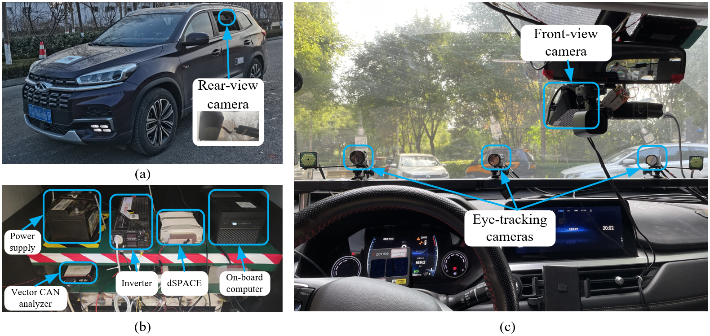
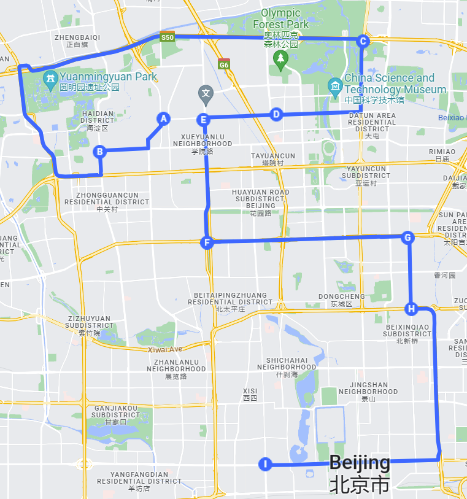

# Naturalistic_driving_dataset_sample
In this project, we construct a naturalistic driving dataset on a real-vehicle platform. 
Compared to previous datasets, our dataset has a broad range of modalities, diverse road conditions, and a large scale. 

- The dataset incorporates three sources of information (i.e., dynamic information of the ego vehicle, traffic environmental information, and driver’s eye movement information), enabling a comprehensive analysis of various maneuvers.

- The experimental route spans primary arterials, secondary arterials, primary expressways, secondary expressways, and collector roads, covering common road types in China. 

- The dataset is large-scale, totaling 104 hours from fifty-two drivers. 

## Apparatus

The apparatus is shown as below. A Sport Utility Vehicle (SUV, model: Chery Tiggo 8) is equipped with an Inertial Measurement Unit (IMU) and a Global Positioning System (GPS) to collect high-precision motion data via CAN bus. The power supply, inverter, Vector CAN analyzer, dSPACE, and the on-board computer are installed in the trunk.

## Route

The route map in the naturalistic driving experiments is shown as below.

## Video

The videos captured by the front-view, rear-view, and eye-tracking cameras during a left lane change (LLC) is shown below.

https://github.com/lijy1516/Naturalistic_driving_dataset_sample/assets/77088809/1bcd2a24-defa-449d-95bc-7505c728c868

